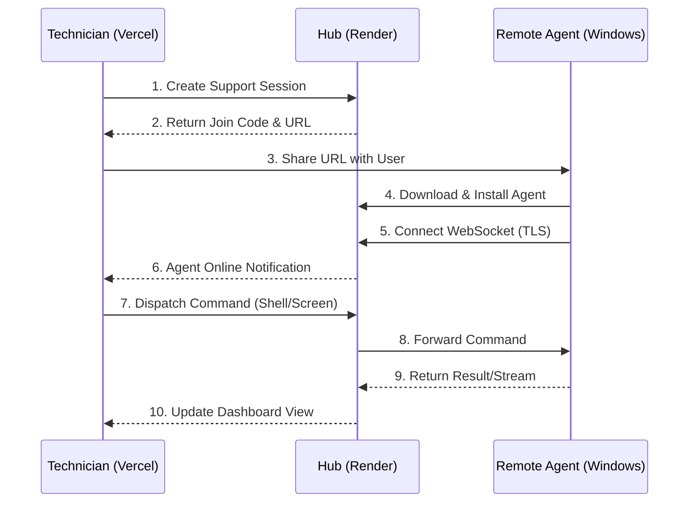

# Skreen 🖥️

**Skreen** is a professional, enterprise-grade **Remote Support and Administration Tool** designed for seamless technical assistance and efficient system management. It features a modern, high-contrast dashboard, a formal Windows installation wizard, and real-time remote support capabilities.

---

## 🚀 Features
- **Professional Installer**: User-facing Windows Setup Wizard (NSIS) with EULA and progress tracking.
- **Real-time Dashboard**: Built with React and Vite, featuring a sleek, dark-mode administrative shell.
- **Comprehensive Control**: 
  - Remote Shell (Terminal)
  - Screen Sharing (Real-time view)
  - Process Management
  - File System Access
  - Remote Uninstallation
- **Dual-Layer Persistence**: Administrative persistence via Windows Scheduled Tasks.
- **Secure Communication**: Encrypted WebSocket communication between agents and the central hub.

---

## 🏗️ Technical Architecture

Skreen operates on a **Hub-and-Spoke** architecture designed for low latency and high reliability:

1.  **Central Hub (Go Server)**: The orchestration engine. It manages WebSocket state, routes administrative commands, and serves the pre-configured agent installers.
2.  **Management Shell (React Dashboard)**: The technician's cockpit. It provides a real-time interface for session management, system monitoring, and remote interaction.
3.  **Remote Service (Go Agent)**: The client-side component. It connects outbound to the hub, bypassing most firewall restrictions, and executes support tasks via a secure internal executor.

### Operational Flow


---

## 📂 Project Structure
```text
/                    (Root)
  /controller        -> React/Vite Frontend (Deploy to Vercel)
  /server            -> Go Backend Hub (Deploy to Render)
  /agent             -> Go Agent Source
  /installer         -> NSIS Wizard Scripts & Assets
  build.ps1          -> Integrated Build Pipeline
```

---

## 🛠️ Local Development & Build

### Prerequisites
- **Go** (v1.22+)
- **Node.js** (v18+)
- **NSIS** (v3.0+) - *Required for building the Windows installer.*

### Integrated Build Pipeline
Use the provided PowerShell script to build the entire stack:
```powershell
# Build for local development
.\build.ps1

# Build for production (Bakes the server URL into the agent)
.\build.ps1 -ServerHost your-api.onrender.com -ServerPort 443
```

---

## ☁️ Deployment Guide

### Frontend: Vercel
1. Set **Root Directory** to `controller`.
2. Add Environment Variable:
   - `VITE_API_URL`: Your backend URL (e.g., `https://skreen-api.onrender.com`).

### Backend: Render
1. Set **Root Directory** to `server`.
2. **Build Command**: `go build -o server ./cmd`
3. **Start Command**: `./server`
4. Add Environment Variables:
   - `CONTROLLER_URL`: Your Vercel dashboard URL.
   - `SCON_SECRET`: A secure random string for management auth.

> [!IMPORTANT]
> Because Render (Linux) cannot compile Windows binaries, you MUST run `.\build.ps1` locally and **commit `server/skreen-agent-setup.exe`** to GitHub so Render can serve it.

---

## 🔒 Security Notice
This software is intended for **authorized administrative use only**. 
- Always set a strong `SCON_SECRET` in production.
- Ensure your Firebase configuration (in `controller/src/firebase.js`) is restricted to authorized domains.
- Skreen is designed to be fully branded; ensure the EULA in `installer/assets/license.txt` reflects your organization's terms.

---

Developed with ❤️ by the Skreen Team.
