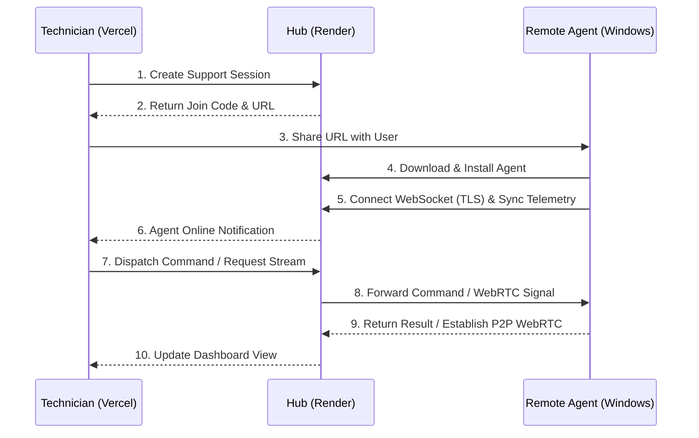

# Skreen 🖥️

**Skreen** is a professional, enterprise-grade **Remote Support and Administration Tool** designed for seamless technical assistance and deep system management. Built on a resilient Go and WebRTC foundation, it bypasses network friction to provide low-latency screen streaming, full-system control, and stealth administrative capabilities.

---

## 🚀 Key Capabilities & Features

### 📡 High-Performance Connectivity
- **Globally Reachable**: Operates seamlessly through NATs and strict firewalls using secure, outbound-only WebSocket tunnels (TLS) to the central Hub.
- **WebRTC Screen Streaming**: Low-latency, P2P (and TURN-relayed) screen casting powered by `pion/webrtc`. Adapts dynamically with `low`, `balanced`, and `high` stream quality profiles.

### 🎛️ Deep System Control (Windows API Integration)
- **Advanced Input Injection**: Modern `SendInput` integration for accurate remote mouse and keyboard control, fully supporting scroll wheels, F-keys, meta keys (Windows), and complex punctuation.
- **Invisible Control (Hidden Desktop Mode)**: Utilizes `CreateDesktopW` to spin up an isolated, invisible Windows desktop. Administrators can trap their remote inputs into this void session, acting as a true "Stealth View" mode that ensures zero interference with the local user's work.
- **Privilege Awareness**: Real-time OS-level privilege detection (via `shell32.IsUserAnAdmin`).

### 🛠️ Tactical Administration
- **Fully-Featured File Explorer**: Professional, high-density React UI for browsing the remote file system. Supports instant uploads, downloads, renaming, and secure directory deletion.
- **Process Management**: Real-time task manager to monitor active processes and securely kill misbehaving applications.
- **Background Toolbox**: Execute PowerShell scripts, CMD commands, and predefined network queries (e.g., `ipconfig`, `netstat`) instantly in the background.
- **Two-Way Clipboard Sync**: Push and pull text from the remote user's clipboard seamlessly.

### 🛡️ Resilience & Security
- **Robust Persistence**: Uses native Windows Registry (`HKCU\...\Run`) to ensure the agent survives reboots. Can be toggled on or off instantly from the dashboard.
- **Clean Uninstallation**: True, untraceable self-termination. Remote uninstalls wipe the persistence registry keys and utilize `MoveFileExW` with `MOVEFILE_DELAY_UNTIL_REBOOT` to securely delete the running executable from disk.
- **Cross-Platform Prepared**: Clean architectural separation with `_windows.go` and `_other.go` build stubs, ensuring Linux/macOS compile safety even for OS-specific features.

---

## 🏗️ Technical Architecture

Skreen operates on a **Hub-and-Spoke** architecture designed for low latency and high reliability:

1. **Central Hub (Go Server)**: The orchestration engine. It manages WebSocket state, routes administrative commands, synchronizes telemetry, and negotiates WebRTC signaling.
2. **Management Shell (React Dashboard)**: The technician's cockpit. Provides a real-time, dark-mode interface for session management, file operations, and tactical command execution.
3. **Remote Service (Go Agent)**: The client-side component. It connects outbound to the hub, executing support tasks via a secure internal executor using deep Win32 API calls.

### Operational Flow


---

## 📂 Project Structure
```text
/                    (Root)
  /controller        -> React/Vite Frontend (Deploy to Vercel)
  /server            -> Go Backend Hub (Deploy to Render)
  /agent             -> Go Agent Source (Win32 API Integrations)
  /installer         -> NSIS Wizard Scripts & Assets
  build.ps1          -> Integrated Build Pipeline
```

---

## 🛠️ Local Development & Build

### Prerequisites
- **Go** (v1.22+)
- **Node.js** (v18+)

### Integrated Build Pipeline
Use the provided PowerShell script to build the entire stack:
```powershell
# Build for local development
.\build.ps1

# Build for production (Bakes the server URL into the agent)
.\build.ps1 -ServerHost your-api.onrender.com -ServerPort 443
```

---

## ☁️ Deployment Guide

### Frontend: Vercel
1. Set **Root Directory** to `controller`.
2. Add Environment Variable:
   - `VITE_API_URL`: Your backend URL (e.g., `https://skreen-api.onrender.com`).

### Backend: Render
1. Set **Root Directory** to `server`.
2. **Build Command**: `go build -o server ./cmd`
3. **Start Command**: `./server`
4. Add Environment Variables:
   - `CONTROLLER_URL`: Your Vercel dashboard URL.
   - `SCON_SECRET`: A secure random string for management auth.

> [!IMPORTANT]
> Because Render (Linux) cannot compile Windows binaries easily, you MUST run `.\build.ps1` locally and **commit `server/skreen-agent-setup.exe`** to GitHub so Render can serve it.

---

## 🔒 Security Notice
This software is intended for **authorized administrative use only**. 
- Always set a strong `SCON_SECRET` in production.
- Keep agent payloads secure and restricted to managed environments.
- Skreen is designed to be fully branded; ensure the EULA in `installer/assets/license.txt` reflects your organization's terms.

---

Developed with ❤️ by the Skreen Team.
